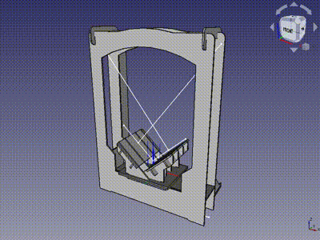
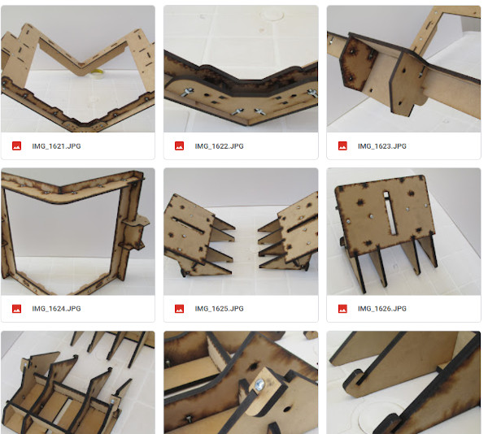
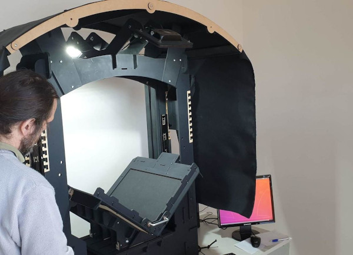

# V-cradle

Bibliohack's V-cradle Book Scanner documentation (open hardware project) 
This device has been successfully installed and used in various heritage institutions of Argentina to carry out low-cost digitization projects. 

### FreeCAD project

[FreeCAD/VShape](FreeCAD/VShape) (open Main_Assembly.FCStd file)

### Assembly images

<https://drive.google.com/drive/folders/1BOZjUhdHQHRd9jAgz4dTz2JxLg7XLaLf?usp=sharing>

### Laser-cut Vectors

Vectors (SVG and PDF) of all MDF pieces arranged in a cutting area of 1250x900 mm. Two thicknesses of MDF are used: 9mm and 5.5mm.

[V-cradle/print/1250x900](V-cradle/print/1250x900)

### BIM

Coming soon!

### Images of the device installed

(this documentation is in its initial stages of development!)
